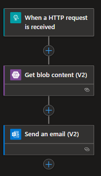
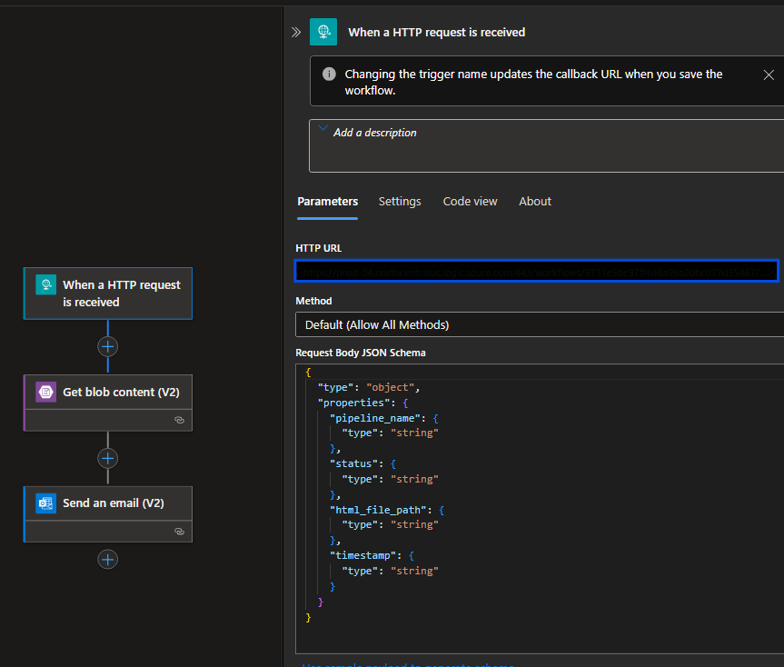
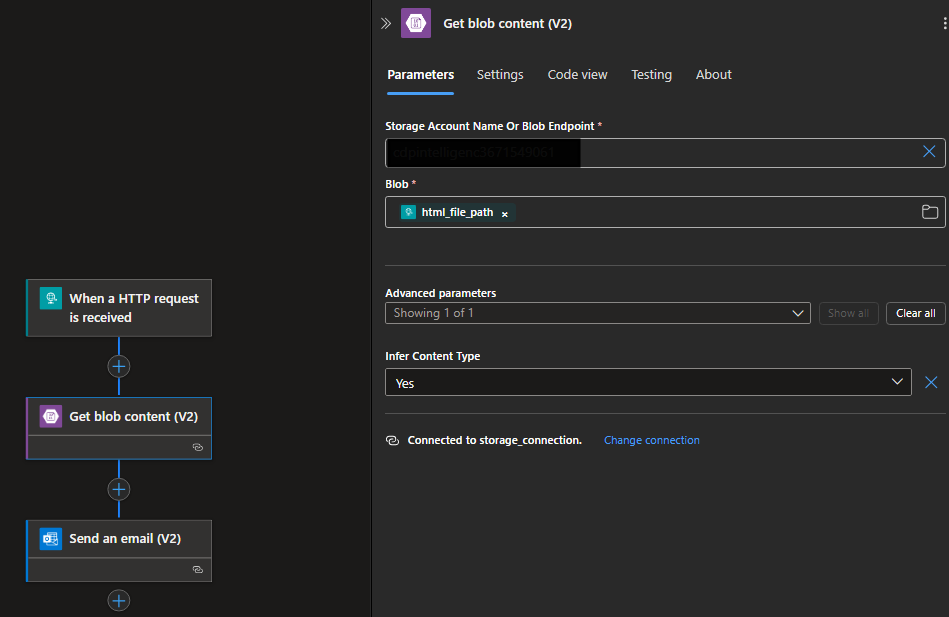
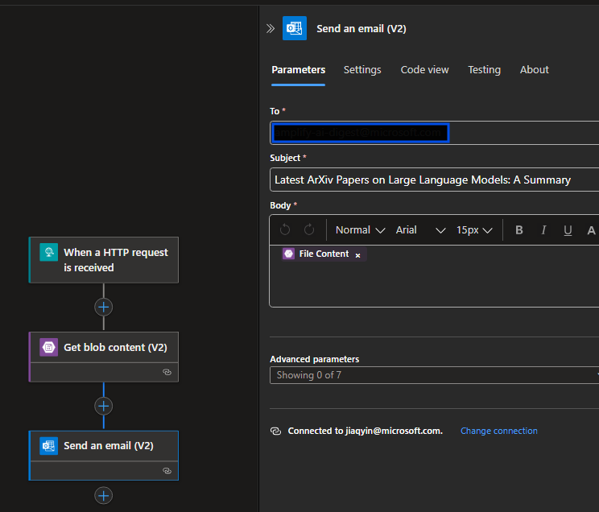

# How I Built a Fully Automated AI-Powered Newsletter That Reads 100+ Research Papers Daily

> **Quick Note**: Previously I shared my side project regarding ArxivSummary for research paper analysis. This time is an upgrade - I've built a complete automated email service that transforms the project into a production-ready newsletter system with zero manual intervention.

*From zero to automated research digest: A complete guide to building an AI system that crawls ArXiv, generates summaries, and emails beautiful newsletters*

---

## The Problem: Information Overload in AI Research

As someone working in AI, I found myself drowning in the daily flood of research papers. ArXiv alone publishes hundreds of papers daily, and keeping up with the latest developments in large language models, multimodal AI, and other cutting-edge topics became impossible.

The traditional approach? Manually browsing papers, bookmarking interesting ones, and hoping to read them later. Spoiler alert: "later" never came.

So I built something better: **a fully automated AI newsletter system** that:
- 🔍 Crawls ArXiv for the latest papers based on custom queries
- 🤖 Uses LLM API to generate comprehensive summaries and analysis
- 📧 Automatically sends beautiful HTML newsletters
- ☁️ Runs entirely on Azure cloud with zero manual intervention

The result? Daily curated research digests that actually help me stay on top of the field.

## Architecture Overview: The Big Picture

The system follows a simple but powerful pipeline:

```
ArXiv Crawling → AI Summarization → HTML Generation → Email Distribution
     ↓              ↓                   ↓                ↓
   100+ papers  →  GPT-4 Analysis  →  Styled Report  →  Auto Email
```

**Key Components:**
- **Azure ML Pipelines**: Orchestrates the entire workflow
- **Custom Python modules**: Handle crawling, summarization, and HTML generation
- **Azure Logic Apps**: Manages email distribution
- **Azure Key Vault**: Securely stores API keys and webhook URLs

## The Magic Behind the Scenes

### 1. Intelligent Paper Crawling ([`src/arxiv_crawler.py`](https://github.com/jackie-jiaqi-yin/ArxivSummary/blob/main/src/arxiv_crawler.py))

The system starts by crawling ArXiv with sophisticated queries:

```python
# Example query for LLM papers
query = '''(cat:cs.CL OR cat:cs.AI) AND (ti:"large language model" OR abs:"large language model" OR ti:LLM OR abs:LLM)'''
```

**Smart features:**
- Configurable paper limits (typically 100-500 per run)
- Category filtering (Computer Science, AI, NLP)
- Date-based filtering for latest research
- Structured data extraction (title, authors, abstract, PDF URLs)

### 2. AI-Powered Analysis ([`src/summarizer.py`](https://github.com/jackie-jiaqi-yin/ArxivSummary/blob/main/src/summarizer.py))

This is where the magic happens. Instead of simple summaries, the system performs **deep research analysis**:

```python
# Multi-batch processing for large datasets
batch_size = 20
max_concurrent_batches = 5
```

**The AI generates:**
- **Research themes**: Identifies 4-6 major research directions
- **Methodological approaches**: Highlights innovative techniques
- **High-impact papers**: Spots potentially groundbreaking work
- **Future directions**: Analyzes emerging trends and challenges

### 3. Beautiful HTML Reports ([`src/html_generator.py`](https://github.com/jackie-jiaqi-yin/ArxivSummary/blob/main/src/html_generator.py))

Raw text isn't engaging. The system generates professional HTML emails with:
- Responsive design that works on all devices
- Academic styling with proper paper citations
- Structured sections for easy scanning
- Direct links to PDF papers

### 4. Azure ML Pipeline Orchestration

The real power comes from Azure ML Pipelines, which handle:

```python
@pipeline(default_compute=cpu_compute_target)
def arxiv_summary_pipeline(max_results, query, system_query):
    # Crawl papers
    arxiv_crawl_node = arxiv_crawl_component(
        max_results=max_results,
        query=query
    )
    
    # Generate summaries
    summary_node = summary_component(
        input_dir=arxiv_crawl_node.outputs.output_dir,
        system_query=system_query,
        model_name='gpt-4o'
    )
    
    # Trigger email
    logic_app_trigger_node = logic_app_trigger_component(
        input_dir=summary_node.outputs.output_dir
    )
```

## The Missing Piece: Azure Logic Apps Email Service

While my code handles data processing, **Azure Logic Apps provides the email infrastructure**. Here's how to set it up:

### Setting Up Azure Logic Apps

**1. Create the Logic App**
- Navigate to Azure Portal → Logic Apps
- Create new Logic App with Consumption plan
- Choose HTTP trigger as the starting point

**2. Design the Workflow**
Here is the diagram of the workflow (which you need to configure in the Logic Apps designer): 


- Action: Send email using Office 365 Outlook or SMTP (you can choose your own email service, which requires login credentials)
  

**2. When a HTTP request is received**
Trigger: HTTP request from Azure ML Pipeline. Add the request body JSON schemas which will also be used in AML Pipeline to trigger the Logic App. 

```json
{
  "type": "object",
  "properties": {
    "pipeline_name": {
      "type": "string"
    },
    "status": {
      "type": "string"
    },
    "html_file_path": {
      "type": "string"
    },
    "timestamp": {
      "type": "string"
    }
  }
}
```

**3. Integrate with Blob Storage**
- Add "Get blob content" action
- Use the `html_file_path` from pipeline trigger
- Extract HTML content for email body


**4. Add Email Actions**
- Choose "Send an email" action (e.g., Office 365 Outlook, or any other SMTP service)
- Configure the email recipient, subject, and body using dynamic content from the previous steps `File Content`.
.

### Connecting ML Pipeline to Logic Apps

The connection happens through the `logic_app_trigger` component:

```python
# AMLPipeline/logic_app_trigger/logic_app_trigger.py
def trigger_logic_app(input_dir, logic_app_name, blob_path_prefix):
    # Get Logic App webhook URL from Key Vault
    keyvault_name = os.getenv('AZURE_KEYVAULT_NAME')
    credential = ManagedIdentityCredential()
    secret_client = SecretClient(vault_url=f"https://{keyvault_name}.vault.azure.net/")
    logic_app_url = secret_client.get_secret(logic_app_name).value
    
    # Find HTML file in pipeline output
    html_file_path = f"{blob_path_prefix}/{html_filename}"
    
    # Trigger Logic App with payload
    payload = {
        "pipeline_name": "ArXiv Summary Pipeline",
        "status": "completed",
        "html_file_path": html_file_path,
        "timestamp": datetime.now().isoformat()
    }
    
    response = requests.post(logic_app_url, json=payload)
```


## Security and Configuration

### Enterprise-Grade Security with Managed Identity

For production deployments, the system uses **User-Assigned Managed Identity (UMI)** instead of API keys - this is the industrial-standard and secure approach.

**1. Configure User-Assigned Managed Identity for Compute Cluster**
```bash
# Environment variables for Azure ML configuration (no API keys needed!)
AZURE_SUBSCRIPTION_ID=your_subscription_id
AZURE_KEYVAULT_NAME=your_keyvault_name
AZURE_MANAGED_IDENTITY_CLIENT_ID=your_mi_client_id
AZURE_OPENAI_ENDPOINT=https://your-resource.openai.azure.com/
```

**2. Managed Identity Permissions Setup**
The User-Assigned Managed Identity requires these role assignments:
- **Azure OpenAI Service**: `Cognitive Services OpenAI User` role
- **Key Vault**: `Key Vault Secrets User` role  
- **Storage Account**: `Storage Blob Data Contributor` role

**3. Secure Authentication Flow**
```python
# Production authentication using Managed Identity
azure_ad_token_provider = get_bearer_token_provider(
    ManagedIdentityCredential(client_id=mi_client_id),
    "https://cognitiveservices.azure.com/.default"
)

# Access Azure OpenAI without API keys
llm = AzureOpenAI(
    azure_ad_token_provider=azure_ad_token_provider,
    use_azure_ad=True
)

# Access Key Vault secrets securely
credential = ManagedIdentityCredential(client_id=mi_client_id)
secret_client = SecretClient(vault_url=key_vault_url, credential=credential)
```

**Key Vault Secrets:**
- `llm-newsletter-logic-app-webhook-url`: Logic App trigger URL
- Email service credentials
- Distribution list configurations

**Why Managed Identity?**
- ❌ **No API keys in code or environment variables**
- ✅ **Automatic credential rotation**
- ✅ **Azure RBAC integration**
- ✅ **Zero credential management overhead**
- ✅ **Audit trail for all access**

## Automation and Scheduling

The system runs on autopilot with Azure DevOps pipelines:

```yaml
# azure-pipelines.yml
schedules:
- cron: "0 2 * * 2,4"  # Tuesdays and Thursdays at 2 AM
  branches:
    include:
    - main
```

**Two pipelines:**
- **LLM Pipeline**: Bi-weekly (Tuesdays/Thursdays) for general LLM research
- **AI Agent Pipeline**: Bi-monthly (1st/15th) for specialized AI agent papers

## Real Results: What the Output Looks Like

The generated newsletters include:

**📊 Paper Catalog**
- Date range and paper count
- Structured metadata

**🎯 Key Research Themes**
- Multimodal Language Models
- Retrieval-Augmented Generation (RAG)
- Model Alignment and Ethics
- Evaluation and Benchmarking

**🔬 Methodological Approaches**
- Memory Pointer Prompting
- Iterative Preference Optimization
- Context Repetition (CoRe)
- Modality Integration Rate (MIR)

**💡 High-Impact Papers**
- Innovation analysis
- Potential impact assessment
- Limitations and future work
